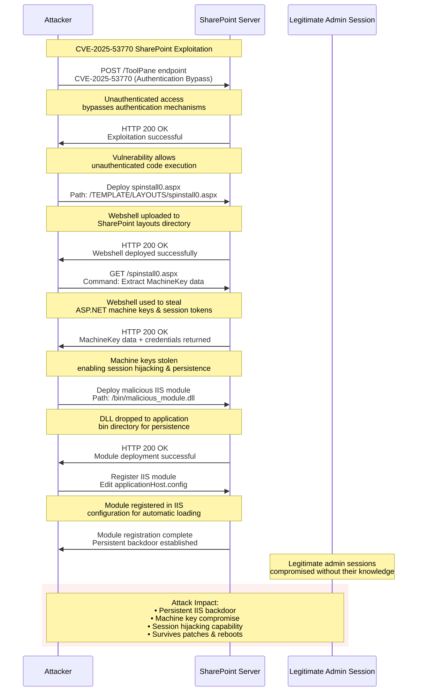

### CVE-2025-53770

SharePoint Vulnerability CVE-2025-53770 Threat Report

Microsoft has identified active exploitation of CVE-2025-53770, a critical unauthenticated remote code execution (RCE) vulnerability affecting on-premises SharePoint Server versions 2016, 2019, and Subscription Edition. This vulnerability, a variant of CVE-2025-49706, allows attackers to execute arbitrary code and access sensitive configuration files without authentication, posing a significant risk to affected organizations.

Recent intelligence indicates that CVE-2025-53770 is part of an exploit chain, dubbed "ToolShell," that leverages deserialization flaws and authentication bypasses to achieve full RCE and extract cryptographic secrets for persistence. This is noteworthy as it highlights a sophisticated multi-stage attack rather than a standalone vulnerability, enabling attackers to maintain access even after initial remediation efforts.

Multiple Chinese nation-state actors, including Linen Typhoon, Violet Typhoon, and Storm-2603, are actively exploiting recently disclosed vulnerabilities in on-premises SharePoint servers (CVE-2025-49706, CVE-2025-49704, CVE-2025-53770, CVE-2025-53771) to gain initial access, establish persistence, and in some cases, deploy ransomware. Organizations with on-premises SharePoint deployments are urged to apply security updates immediately and implement enhanced monitoring to detect post-exploitation activities.

The article highlights the rapid adoption and chaining of newly disclosed SharePoint vulnerabilities (CVE-2025-53770 and CVE-2025-53771) which are variants of previously known flaws (CVE-2025-49704 and CVE-2025-49706), enabling unauthenticated remote code execution and authentication bypass. This evolution is noteworthy as it demonstrates attackers' ability to quickly adapt and bypass initial patches, emphasizing the need for continuous vigilance and comprehensive security updates.

### Actionable Threat Data
---

Monitor for the creation of `spinstall0.aspx` or files with `spinstall0` in the filename within SharePoint server directories, specifically `MICROS~1\WEBSER~1\16\TEMPLATE\LAYOUTS`.

Look for suspicious process creation originating from `w3wp.exe` that involves `cmd.exe` followed by `powershell.exe` with encoded commands, indicating potential post-exploitation activity.

Implement logging and monitor for unauthenticated `POST` requests to `/_layouts/15/ToolPane.aspx` with a spoofed Referer: `/_layouts/SignOut.aspx` header, as this is a key indicator of the authentication bypass used in the exploit chain.

Monitor network traffic for connections to known malicious IP addresses associated with this exploitation, such as `107.191.58[.]76`, `104.238.159[.]149`, and `96.9.125[.]147`.

Investigate alerts related to "Possible web shell installation," "Possible exploitation of SharePoint server vulnerabilities," "Suspicious IIS worker process behavior," and "malware blocked" on SharePoint servers, specifically `SuspSignoutReq` and `HijackSharePointServer`.

Identify attempts to disable Microsoft Defender protections via registry modifications or the abuse of `services.exe`, which is a common defense evasion technique used by threat actors like Storm-2603.

### Lateral Movement and Ransomware Deployment:

Look for the use of `Mimikatz` for credential dumping (T1003.001), `PsExec` and `Impacket` for lateral movement (T1570), and modifications to Group Policy Objects (GPO) for ransomware distribution (T1484.001). Specifically, monitor for the deployment of `Warlock` or `Lockbit` ransomware.



### SharePoint Reconnaissance
---
```sql
`comment("This search requires the Web data model to be populated with data from web servers, proxies, or network sensors.")`
| tstats `summariesonly` count min(_time) as firstTime max(_time) as lastTime from datamodel=Web
-- Search for GET requests to the specific ToolPane.aspx page with the DisplayMode=Edit query.
where Web.http_method="GET" AND Web.url="*/_layouts/15/ToolPane.aspx?DisplayMode=Edit"
-- Look for the specific user agent used by the exploit tool.
AND Web.http_user_agent="python-requests/2.32.3"
-- Ensure there is no referrer, which is typical of automated scanning tools.
AND (Web.http_referrer="-" OR Web.http_referrer=NULL)
-- Group by the relevant fields to aggregate events.
by Web.src, Web.dest, Web.user, Web.url, Web.http_user_agent
| `drop_dm_object_name("Web")`
-- Rename fields for clarity in the output.
| rename src as src_ip, dest as dest_ip, user as user_name, url as request_url, http_user_agent as user_agent
`comment("The combination of a specific URI, user-agent, and lack of referrer is a high-fidelity indicator of this specific reconnaissance technique. However, other benign security scanners or custom scripts could potentially match this behavior, so it is important to validate the source of the activity.")`
```

### SharePoint spinstall0.aspx Creation - Initial day 1 discovery

Active exploitation of CVE-2025-53770 involves the creation of this file, indicating successful post-exploitation.

T1005: Data from Local System

T1083: File and Directory Discovery

```sql
`comment: "This detection rule identifies the creation of a specific ASPX file, 'spinstall0.aspx', in a SharePoint server directory. This activity is a known indicator of compromise (IoC) following the successful exploitation of the SharePoint vulnerability CVE-2025-53770, as detailed by Microsoft. The rule leverages endpoint file creation events."`
`comment: "Data source: This rule requires endpoint data with file creation events, mapped to the 'Filesystem' object of the Splunk Common Information Model (CIM). This includes data from sources like Sysmon (EventCode 11), Microsoft Defender for Endpoint, CrowdStrike, etc."`
`comment: "False Positives: False positives are unlikely due to the specificity of the file name and path. However, the wildcard search for '*spinstall0*' could potentially match legitimate files if any exist. Consider adding exclusions for known administrative or patching processes if benign activity is observed."`

| tstats `summariesonly`=true allow_old_summaries=true count min(_time) as firstTime max(_time) as lastTime from datamodel=Endpoint.Filesystem
# Filter for file creation events.
where Filesystem.action="created"
# Filter for the specific webshell filename and path associated with CVE-2025-53770.
  AND (Filesystem.file_name="spinstall0.aspx" OR Filesystem.file_name LIKE "%spinstall0%")
  AND (Filesystem.file_path LIKE "%MICROS~1\\WEBSER~1\\16\\TEMPLATE\\LAYOUTS%")
# Group by relevant host and file attributes.
by Filesystem.dest, Filesystem.user, Filesystem.process_name, Filesystem.file_path, Filesystem.file_name, Filesystem.file_hash
# Rename fields for better readability and downstream actions.
| rename Filesystem.dest as dest, Filesystem.user as user, Filesystem.process_name as process_name, Filesystem.file_path as file_path, Filesystem.file_name as file_name, Filesystem.file_hash as file_hash
# Convert epoch timestamps to human-readable format.
| fieldformat firstTime=strftime(firstTime, "%Y-%m-%d %H:%M:%S")
| fieldformat lastTime=strftime(lastTime, "%Y-%m-%d %H:%M:%S")
# Add metadata fields for context.
| fields firstTime, lastTime, dest, user, process_name, file_path, file_name, file_hash, count
```

### Exploitation Common Observed
---
```sql
`comment("This search requires the Web data model to be populated with data from web servers, proxies, or network sensors.")`
| tstats `summariesonly` count min(_time) as firstTime max(_time) as lastTime from datamodel=Web
where
  (
    -- Pattern 1: Reconnaissance or exploitation of ToolPane.aspx, a known entry point.
    (Web.url="*/_layouts/15/ToolPane.aspx*" AND Web.url="*DisplayMode=Edit*")
    OR
    -- Pattern 2: Interaction with known malicious webshells in SharePoint directories.
    (Web.url IN ("*/_layouts/*", "*/layouts/*") AND Web.url IN ("*spinstall*.aspx*", "*info*.aspx*", "*debug*.aspx*"))
    OR
    -- Pattern 3: Potential deserialization attempt using ViewState in POST data.
    (Web.url="*/_layouts/15/ToolPane.aspx*" AND Web.http_method="POST" AND Web.form_data="*VIEWSTATE*")
  )
-- Group by relevant fields for investigation and to reduce noise.
by Web.src, Web.dest, Web.user, Web.url, Web.http_method, Web.http_user_agent, Web.form_data
| `drop_dm_object_name("Web")`
-- Rename fields for clarity in the output.
| rename src as src_ip, dest as dest_ip, user as user_name, url as request_url, http_method as http_method, http_user_agent as user_agent, form_data as http_post_data
`comment("This rule combines several patterns seen in the ToolShell exploit chain. It looks for reconnaissance against ToolPane.aspx, interaction with known webshell names, and potential deserialization payloads. Legitimate administrative activity might use ToolPane.aspx, so review the source IP and user agent for anomalous activity. The presence of webshell names like 'spinstall' is a high-fidelity indicator of compromise.")`
```

### SharePoint Web Shell
---
```sql
`comment("
date: 2025-07-23
description: This detection identifies the creation of suspicious ASPX files in specific SharePoint directories. This is a known post-exploitation technique used by threat actors after successfully exploiting vulnerabilities like CVE-2025-53770 to deploy web shells for persistence and further access.
references:
  - https://www.microsoft.com/en-us/security/blog/2025/07/22/disrupting-active-exploitation-of-on-premises-sharepoint-vulnerabilities/
")`

`comment("This search leverages the Endpoint data model and is optimized for performance using tstats.")`
| tstats summariesonly=true count min(_time) as firstTime max(_time) as lastTime from datamodel=Endpoint.Filesystem where (Filesystem.action=created) AND (Filesystem.file_name="spinstall*.aspx") AND (Filesystem.file_path="*\\Microsoft Shared\\Web Server Extensions\\1[56]\\TEMPLATE\\LAYOUTS\\*") by Filesystem.dest, Filesystem.user, Filesystem.process_name, Filesystem.file_path, Filesystem.file_name

`comment("Rename fields for better readability.")`
| rename "Filesystem.*" as *

`comment("Convert epoch timestamps to human-readable format.")`
| convert ctime(firstTime) ctime(lastTime)

`comment("FP Note: The file name pattern is specific to observed attacks, but legitimate admin or patching activities could potentially generate false positives. Investigate the creating process (e.g., w3wp.exe is highly suspicious) and the user context to validate.")`
| fields firstTime, lastTime, dest, user, process_name, file_name, file_path, count
```

### Encoded PowerShell Writing to SharePoint Directory
---
```sql
`comment("This search requires the Endpoint data model to be populated with process execution data, such as from Sysmon or EDR logs.")`
| tstats `summariesonly` count min(_time) as firstTime max(_time) as lastTime from datamodel=Endpoint.Processes
  where Processes.process_name = "powershell.exe"
-- Look for PowerShell commands that indicate Base64 encoding or decoding.
  AND (Processes.process = "*-EncodedCommand*" OR Processes.process = "*-enc*" OR Processes.process = "*FromBase64String*")
-- Look for commands that write content to a file.
  AND (Processes.process = "*Out-File*" OR Processes.process = "*Set-Content*")
-- The file path is a key indicator for SharePoint exploitation.
  AND Processes.process IN ("*\\template\\layouts\\*", "*\\TEMPLATES\\LAYOUTS\\*")
-- Group by relevant fields for investigation.
  by Processes.dest, Processes.user, Processes.parent_process_name, Processes.process_name, Processes.process
| `drop_dm_object_name("Processes")`
-- Rename fields for clarity.
| rename dest as endpoint, user as user_name, parent_process_name as parent_process, process_name as process, process as process_command_line
`comment("While the use of Base64 encoding to write files to a SharePoint directory is highly suspicious, some administrative scripts may perform similar actions. Review the parent process and the full command line to determine legitimacy.")`
```

### Suspicious w3wp.exe Child Process Chain
---
```sql
`comment: "Title: Suspicious w3wp.exe Child Process Chain"`
`comment: "Description: This rule detects a process execution chain where the IIS worker process (w3wp.exe) spawns a command shell (cmd.exe), which in turn launches PowerShell with an encoded command. This behavior is a strong indicator of post-exploitation activity following a web server compromise, such as the one seen with SharePoint vulnerability CVE-2025-53770."`
`comment: "Data Source: This rule requires endpoint process creation events, mapped to the 'Processes' object of the Splunk Common Information Model (CIM). The query relies on process GUIDs for accurate correlation, which are typically provided by sources like Sysmon (EventCode 1)."`
`comment: "False Positives: False positives are unlikely due to the specificity of this process chain. However, some legitimate but unusual administrative or application management scripts might spawn shells from w3wp.exe. If benign activity is observed, consider adding exclusions for specific command lines or user accounts. Note: This query uses a join, which may have performance implications in large-scale environments."`
`comment: "MITRE ATT&CK TTPs: T1059.001 (PowerShell), T1059.003 (Windows Command Shell)"`
`comment: "References: https://msrc.microsoft.com/blog/2025/07/customer-guidance-for-sharepoint-vulnerability-cve-2025-53770/"`

# Main search: Find PowerShell with an encoded command spawned by cmd.exe.
| tstats `summariesonly`=true allow_old_summaries=true min(_time) as firstTime, max(_time) as lastTime, values(Processes.process) as powershell_command, values(Processes.parent_process) as cmd_process from datamodel=Endpoint.Processes
  where Processes.process_name="powershell.exe" AND Processes.parent_process_name="cmd.exe"
  AND (Processes.process LIKE "% -e %" OR Processes.process LIKE "% -en %" OR Processes.process LIKE "% -enc %" OR Processes.process LIKE "% -encodedcommand %")
  by Processes.dest, Processes.user, Processes.parent_process_guid

# Join: Correlate the cmd.exe parent process with its own parent, looking for w3wp.exe.
| join type=inner dest, Processes.parent_process_guid [
    | tstats `summariesonly`=true allow_old_summaries=true values(Processes.parent_process) as w3wp_process from datamodel=Endpoint.Processes
      where Processes.process_name="cmd.exe" AND Processes.parent_process_name="w3wp.exe"
      by Processes.dest, Processes.process_guid
    | rename Processes.process_guid as Processes.parent_process_guid, dest as dest
]

# Formatting: Clean up fields for alerting and investigation.
| rename Processes.dest as dest, Processes.user as user
| fieldformat firstTime=strftime(firstTime, "%Y-%m-%d %H:%M:%S")
| fieldformat lastTime=strftime(lastTime, "%Y-%m-%d %H:%M:%S")
| fields firstTime, lastTime, dest, user, w3wp_process, cmd_process, powershell_command
```

### w3wp.exe Spawning Encoded Cmd/PowerShell
---
```sql
`comment("
date: 2025-07-23
description: This detection identifies the SharePoint worker process (w3wp.exe) spawning a command shell (cmd.exe or powershell.exe) with a base64 encoded command. The decoded command is then inspected for keywords related to known SharePoint exploitation TTPs, such as the 'spinstall' web shell. This behavior is highly indicative of post-exploitation activity following a successful web shell upload.
references:
  - https://www.microsoft.com/en-us/security/blog/2025/07/22/disrupting-active-exploitation-of-on-premises-sharepoint-vulnerabilities/
")`

`comment("Start search on process execution events from the Endpoint data model.")`
from datamodel=Endpoint.Processes

`comment("Filter for w3wp.exe spawning a command shell, a common indicator of web shell execution.")`
| where Processes.parent_process_name = "w3wp.exe" AND Processes.process_name IN ("cmd.exe", "powershell.exe")

`comment("Use regex to extract the base64 encoded block from the command line.")`
| rex field=Processes.process "(?i)(?:-e(?:n(?:c(?:o(?:dedcommand)?)?)?)?)\s+(?<b64_command>[A-Za-z0-9+/=]{20,})"

`comment("Proceed only if a base64 block was found, then decode it.")`
| where isnotnull(b64_command)
| eval decoded_command = base64(b64_command, "decode")

`comment("Filter for decoded commands containing suspicious keywords related to this threat.")`
| where like(decoded_command, "%spinstall%") OR like(decoded_command, "%TEMPLATE\\LAYOUTS%")

`comment("Aggregate results to show the first and last time this activity was seen, along with key details.")`
| stats count min(_time) as firstTime max(_time) as lastTime values(Processes.process) as cmd, values(decoded_command) as decoded_cmd by Processes.dest, Processes.user, Processes.parent_process_name, Processes.process_name
| rename "Processes.*" as *

`comment("Convert epoch timestamps to human-readable format.")`
| convert ctime(firstTime) ctime(lastTime)

`comment("FP Note: While w3wp.exe spawning command shells is inherently suspicious, some custom applications or admin scripts might perform similar actions. The presence of SharePoint-specific keywords in a decoded command significantly increases confidence. Review the decoded command and user context to confirm malicious intent.")`
| fields firstTime, lastTime, dest, user, parent_process_name, process_name, cmd, decoded_cmd, count
```

### Unauthenticated ToolPane.aspx POST
---
```sql
`comment: "Title: SharePoint Unauthenticated POST to ToolPane.aspx (CVE-2025-53770)"`
`comment: "Description: Detects a POST request to /_layouts/15/ToolPane.aspx with a spoofed Referer header of /_layouts/SignOut.aspx. This specific pattern is a key indicator of an authentication bypass used in the exploit chain for CVE-2025-53770."`
`comment: "Date: 2025-07-21"`
`comment: "Data Source: This rule requires web server logs (e.g., IIS) or network traffic data mapped to the 'Web' object of the Splunk Common Information Model (CIM)."`
`comment: "False Positives: False positives are considered unlikely due to the specific combination of URL, HTTP method, and Referer header. However, if legitimate unauthenticated access to this page is identified, consider adding source IP or user agent exclusions."`
`comment: "MITRE ATT&CK TTPs: T1190 (Exploit Public-Facing Application)"`
`comment: "References: https://msrc.microsoft.com/blog/2025/07/customer-guidance-for-sharepoint-vulnerability-cve-2025-53770/"`

| tstats `summariesonly`=true allow_old_summaries=true count min(_time) as firstTime max(_time) as lastTime from datamodel=Web.Web
  # Filter for the specific exploit pattern: POST to ToolPane.aspx with a SignOut.aspx Referer.
  where Web.http_method="POST" AND Web.url="*/_layouts/15/ToolPane.aspx" AND Web.http_referrer="*/_layouts/SignOut.aspx"
  # Focus on unauthenticated attempts, which is characteristic of this exploit.
  AND (isnull(Web.user) OR Web.user="-" OR Web.user="anonymous")
  # Group by key fields to create a unique alert for each source/destination pair.
  by Web.src, Web.dest, Web.user, Web.url, Web.http_referrer, Web.status
# Rename fields for clarity.
| rename Web.src as src_ip, Web.dest as dest_ip, Web.user as user, Web.url as url, Web.http_referrer as http_referrer, Web.status as status
# Format timestamps for readability.
| fieldformat firstTime=strftime(firstTime, "%Y-%m-%d %H:%M:%S")
| fieldformat lastTime=strftime(lastTime, "%Y-%m-%d %H:%M:%S")
# Structure the final output.
| fields firstTime, lastTime, src_ip, dest_ip, user, url, http_referrer, status, count
```

### SharePoint ToolPane Exploitation
---
```sql
`comment("
date: 2025-07-23
description: This detection identifies potential exploitation of SharePoint vulnerabilities (e.g., CVE-2025-53770) by looking for POST requests to the ToolPane.aspx endpoint with a spoofed Referer header pointing to SignOut.aspx. This is a known TTP for initial access.
references:
  - https://www.microsoft.com/en-us/security/blog/2025/07/22/disrupting-active-exploitation-of-on-premises-sharepoint-vulnerabilities/
")`

`comment("This search leverages the Web data model and is optimized for performance using tstats.")`
| tstats summariesonly=true count min(_time) as firstTime max(_time) as lastTime from datamodel=Web where Web.http_method="POST" AND Web.url="*/_layouts/1[56]/ToolPane.aspx" AND Web.http_referer="*/_layouts/1[56]/SignOut.aspx" by Web.src, Web.dest, Web.user, Web.http_user_agent, Web.url, Web.http_referer

`comment("Rename fields for better readability.")`
| rename "Web.*" as *

`comment("Convert epoch timestamps to human-readable format.")`
| convert ctime(firstTime) ctime(lastTime)

`comment("FP Note: This combination of URL and Referer is highly specific to the exploit. However, a custom application could theoretically generate similar traffic. Investigate the source IP and user agent for signs of scanning or non-standard client behavior.")`
| fields firstTime, lastTime, src, dest, user, http_user_agent, url, http_referer, count
```

### Machine Key Exfiltration
---
```sql
`comment("This search requires the Web data model to be populated with data from web servers, proxies, or network sensors that log full HTTP headers.")`
| tstats `summariesonly` values(Web.http_headers) as http_headers count min(_time) as firstTime max(_time) as lastTime from datamodel=Web
-- The core of the detection is the presence of the custom X-TXT-NET header.
  where Web.http_headers = "*X-TXT-NET*"
-- Group by relevant fields for investigation.
  by Web.src, Web.dest, Web.user, Web.url
| `drop_dm_object_name("Web")`
-- Rename fields for clarity.
| rename src as sharepoint_server_ip, dest as destination_ip, user as user_name, url as request_url, http_headers as http_request_headers
`comment("This activity is a strong indicator of compromise, as the 'X-TXT-NET' header is specific to this malware. Confirm that the source IP is a known SharePoint server in your environment. The exfiltrated key material may be visible in the http_request_headers field.")`
```

### Known Malicious IPs (NOTE: Initial Day 1 Discovery)
---
```sql
`comment: "Title: Known Malicious IPs Associated with SharePoint Exploitation (CVE-2025-53770)"`
`comment: "Description: This rule detects network traffic to or from IP addresses that have been identified as being involved in the active exploitation of SharePoint vulnerability CVE-2025-53770."`
`comment: "Date: 2025-07-21"`
`comment: "Data Source: This rule requires network traffic data (e.g., firewall, proxy, NetFlow) mapped to the 'All_Traffic' object of the Splunk Common Information Model (CIM)."`
`comment: "False Positives: The listed IP addresses are reported as actively malicious. However, IP addresses can be reallocated over time. To reduce potential false positives, consider filtering this search to only include traffic where your SharePoint servers are the source or destination."`
`comment: "MITRE ATT&CK TTPs: T1071.001 (Application Layer Protocol: Web Protocols)"`
`comment: "References: https://msrc.microsoft.com/blog/2025/07/customer-guidance-for-sharepoint-vulnerability-cve-2025-53770/"`

| tstats `summariesonly`=true allow_old_summaries=true count min(_time) as firstTime max(_time) as lastTime from datamodel=Network_Traffic.All_Traffic
# Search for traffic where the source or destination IP matches the known malicious IPs.
where (All_Traffic.src_ip IN ("107.191.58.76", "104.238.159.149", "96.9.125.147") OR All_Traffic.dest_ip IN ("107.191.58.76", "104.238.159.149", "96.9.125.147"))
# Group by key network fields to create a unique alert.
by All_Traffic.src_ip, All_Traffic.dest_ip, All_Traffic.dest_port, All_Traffic.action
# Rename fields for clarity.
| rename All_Traffic.src_ip as src_ip, All_Traffic.dest_ip as dest_ip, All_Traffic.dest_port as dest_port, All_Traffic.action as action
# Format timestamps for readability.
| fieldformat firstTime=strftime(firstTime, "%Y-%m-%d %H:%M:%S")
| fieldformat lastTime=strftime(lastTime, "%Y-%m-%d %H:%M:%S")
# Structure the final output.
| fields firstTime, lastTime, src_ip, dest_ip, dest_port, action, count
```

### Malicious SharePoint IPs
---
```sql
`comment("
date: 2025-07-23
description: This detection identifies network traffic to or from IP addresses known to be associated with command and control (C2) infrastructure or active exploitation in recent SharePoint vulnerability campaigns. Communication with these IPs is a strong indicator of either an attempted attack or an existing compromise.
references:
  - https://www.microsoft.com/en-us/security/blog/2025/07/22/disrupting-active-exploitation-of-on-premises-sharepoint-vulnerabilities/
")`

`comment("Use tstats for a performant search against the Network_Traffic data model for known malicious IPs.")`
| tstats summariesonly=true count min(_time) as firstTime max(_time) as lastTime from datamodel=Network_Traffic where (Network_Traffic.dest_ip IN ("131.226.2.6", "134.199.202.205", "104.238.159.149", "188.130.206.168", "65.38.121.198") OR Network_Traffic.src_ip IN ("131.226.2.6", "134.199.202.205", "104.238.159.149", "188.130.206.168", "65.38.121.198")) by Network_Traffic.src_ip, Network_Traffic.dest_ip, Network_Traffic.user, Network_Traffic.dest_port

`comment("Rename fields for better readability.")`
| rename "Network_Traffic.*" as *

`comment("Determine if the traffic is inbound (from malicious IP) or outbound (to malicious IP).")`
| eval direction = if(src_ip IN ("131.226.2.6", "134.199.202.205", "104.238.159.149", "188.130.206.168", "65.38.121.198"), "inbound", "outbound")

`comment("Convert epoch timestamps to human-readable format.")`
| convert ctime(firstTime) ctime(lastTime)

`comment("FP Note: IP addresses can be reassigned over time. While these IPs are currently associated with malicious activity, their status may change. Investigate the context of the traffic, such as the port, protocol, and associated processes on the internal host, to validate the alert.")`
| fields firstTime, lastTime, src_ip, dest_ip, dest_port, user, direction, count
```

### SharePoint Malware Detections
---
```sql
`comment: "Title: SharePoint Malware Detections (CVE-2025-53770)"`
`comment: "Description: This rule detects alerts from endpoint security products that have identified malware signatures ('SuspSignoutReq', 'HijackSharePointServer') associated with the exploitation of SharePoint vulnerability CVE-2025-53770."`
`comment: "Date: 2025-07-21"`
`comment: "Data Source: This rule requires data from endpoint security tools (Antivirus, EDR) mapped to the 'Malware' object of the Splunk Common Information Model (CIM)."`
`comment: "False Positives: False positives are unlikely as this rule triggers on specific signatures from security products. However, to increase fidelity, it is recommended to filter the search to only run on known SharePoint servers."`
`comment: "MITRE ATT&CK TTPs: T1053.005 (Scheduled Task/Job), T1547.001 (Registry Run Keys / Startup Folder)"`
`comment: "References: https://msrc.microsoft.com/blog/2025/07/customer-guidance-for-sharepoint-vulnerability-cve-2025-53770/"`

| tstats `summariesonly`=true allow_old_summaries=true count min(_time) as firstTime max(_time) as lastTime from datamodel=Endpoint.Malware
# Filter for the specific malware signatures associated with CVE-2025-53770 exploitation.
where (Malware.signature IN ("*SuspSignoutReq*", "*HijackSharePointServer*"))
# To reduce false positives, consider filtering for your SharePoint servers.
# Example: AND Malware.dest IN (<list_of_sharepoint_servers>)
# Group by key fields to create a unique alert.
by Malware.dest, Malware.signature, Malware.file_path, Malware.user, Malware.action
# Rename fields for clarity.
| rename Malware.dest as dest, Malware.signature as signature, Malware.file_path as file_path, Malware.user as user, Malware.action as action
# Format timestamps for readability.
| fieldformat firstTime=strftime(firstTime, "%Y-%m-%d %H:%M:%S")
| fieldformat lastTime=strftime(lastTime, "%Y-%m-%d %H:%M:%S")
# Structure the final output.
| fields firstTime, lastTime, dest, user, file_path, signature, action, count
```

### Defender Protection Disablement
---
```sql
`comment("
date: 2025-07-23
description: This detection identifies attempts to disable or tamper with Microsoft Defender Antivirus using common command-line tools. This is a frequent defense evasion technique used by threat actors, including those exploiting SharePoint vulnerabilities, to operate undetected on a compromised host.
references:
  - https://www.microsoft.com/en-us/security/blog/2025/07/22/disrupting-active-exploitation-of-on-premises-sharepoint-vulnerabilities/
")`

`comment("Start search on process execution events, using tstats for performance.")`
| tstats `security_content_summariesonly` count min(_time) as firstTime max(_time) as lastTime from datamodel=Endpoint.Processes where (Processes.process_name IN ("powershell.exe", "sc.exe", "net.exe", "reg.exe")) AND (Processes.process IN ("*Set-MpPreference*", "*DisableAntiSpyware*", "*WinDefend*")) by Processes.dest, Processes.user, Processes.parent_process_name, Processes.process_name, Processes.process

`comment("Filter for specific, high-confidence patterns of Defender disablement.")`
| where
    (process_name="powershell.exe" AND (like(process, "%Set-MpPreference -DisableRealtimeMonitoring `$true%") OR like(process, "%Set-MpPreference -DisableRealtimeMonitoring 1%"))) OR
    (process_name IN ("sc.exe", "net.exe") AND (like(process, "%stop WinDefend%") OR like(process, "%config WinDefend%start=%disabled%"))) OR
    (process_name="reg.exe" AND like(process, "%add%HKLM\\SOFTWARE\\Policies\\Microsoft\\Windows Defender%") AND like(process, "%/v DisableAntiSpyware%") AND like(process, "%/d 1%"))

`comment("Rename fields for better readability.")`
| rename "Processes.*" as *

`comment("Convert epoch timestamps to human-readable format.")`
| convert ctime(firstTime) ctime(lastTime)

`comment("FP Note: Legitimate administrative scripts may perform these actions. Review the user, parent process (e.g., w3wp.exe is highly suspicious), and context of the activity to determine if it is authorized.")`
| fields firstTime, lastTime, dest, user, parent_process_name, process_name, process, count
```

### Mimikatz/PsExec/Impacket Usage
---
```sql
`comment("
date: 2025-07-23
description: This detection identifies the use of common post-exploitation tools like PsExec, Impacket, and Mimikatz. These tools are frequently used by threat actors for lateral movement and credential access after gaining initial access, as seen in recent SharePoint exploitation campaigns.
references:
  - https://www.microsoft.com/en-us/security/blog/2025/07/22/disrupting-active-exploitation-of-on-premises-sharepoint-vulnerabilities/
")`

`comment("Start search on process execution events, using tstats for performance.")`
| tstats `security_content_summariesonly` count min(_time) as firstTime max(_time) as lastTime from datamodel=Endpoint.Processes where (Processes.process_name IN ("PSEXESVC.exe", "cmd.exe") OR Processes.parent_process_name="WmiPrvSE.exe" OR Processes.process IN ("*sekurlsa::*", "*lsadump::*")) by Processes.dest, Processes.user, Processes.parent_process_name, Processes.process_name, Processes.process

`comment("Filter for specific patterns related to PsExec, Impacket, and Mimikatz.")`
| where
    (process_name="PSEXESVC.exe" AND parent_process_name="services.exe") OR
    (parent_process_name="WmiPrvSE.exe" AND process_name="cmd.exe" AND like(process, "%1> \\\\127.0.0.1\\ADMIN$%")) OR
    (like(process, "%sekurlsa::logonpasswords%") OR like(process, "%lsadump::sam%"))

`comment("Categorize the detected tool for easier analysis.")`
| eval tool_detected = case(
    process_name="PSEXESVC.exe", "PsExec",
    parent_process_name="WmiPrvSE.exe", "Impacket (WMIExec)",
    like(process, "%sekurlsa::%") OR like(process, "%lsadump::%"), "Mimikatz",
    1=1, "Unknown"
)

`comment("Rename fields for better readability.")`
| rename "Processes.*" as *

`comment("Convert epoch timestamps to human-readable format.")`
| convert ctime(firstTime) ctime(lastTime)

`comment("FP Note: PsExec is a legitimate administrative tool. Its use should be correlated with other suspicious activity or verified against authorized administrative tasks. The Mimikatz and Impacket patterns are high-fidelity but may appear during authorized penetration testing.")`
| fields firstTime, lastTime, dest, user, parent_process_name, process_name, process, count, tool_detected
```

### Malicious SharePoint Hashes
---
```sql
`comment("
date: 2025-07-23
description: This detection identifies known malicious file hashes associated with SharePoint exploitation campaigns. These hashes correspond to web shells and post-exploitation tools observed in attacks by threat actors like Storm-2603.
references:
  - https://www.microsoft.com/en-us/security/blog/2025/07/22/disrupting-active-exploitation-of-on-premises-sharepoint-vulnerabilities/
")`

`comment("Search for known malicious hashes in both running processes and files on disk using tstats for performance.")`
| tstats `security_content_summariesonly` count min(_time) as firstTime max(_time) as lastTime from datamodel=Endpoint where (Processes.process_hash IN ("92bb4ddb98eeaf11fc15bb32e71d0a63256a0ed826a03ba293ce3a8bf057a514", "24480dbe306597da1ba393b6e30d542673066f98826cc07ac4b9033137f37dbf", "b5a78616f709859a0d9f830d28ff2f9dbbb2387df1753739407917e96dadf6b0", "c27b725ff66fdfb11dd6487a3815d1d1eba89d61b0e919e4d06ed3ac6a74fe94", "1eb914c09c873f0a7bcf81475ab0f6bdfaccc6b63bf7e5f2dbf19295106af192", "4c1750a14915bf2c0b093c2cb59063912dfa039a2adfe6d26d6914804e2ae928", "83705c75731e1d590b08f9357bc3b0f04741e92a033618736387512b40dab060", "f54ae00a9bae73da001c4d3d690d26ddf5e8e006b5562f936df472ec5e299441", "b180ab0a5845ed619939154f67526d2b04d28713fcc1904fbd666275538f431d", "6753b840cec65dfba0d7d326ec768bff2495784c60db6a139f51c5e83349ac4d", "7ae971e40528d364fa52f3bb5e0660ac25ef63e082e3bbd54f153e27b31eae68", "567cb8e8c8bd0d909870c656b292b57bcb24eb55a8582b884e0a228e298e7443", "445a37279d3a229ed18513e85f0c8d861c6f560e0f914a5869df14a74b679b86", "ffbc9dfc284b147e07a430fe9471e66c716a84a1f18976474a54bee82605fa9a", "6b273c2179518dacb1218201fd37ee2492a5e1713be907e69bf7ea56ceca53a5", "c2c1fec7856e8d49f5d49267e69993837575dbbec99cd702c5be134a85b2c139", "d6da885c90a5d1fb88d0a3f0b5d9817a82d5772d5510a0773c80ca581ce2486d", "62881359e75c9e8899c4bc9f452ef9743e68ce467f8b3e4398bebacde9550dea") OR Filesystem.file_hash IN ("92bb4ddb98eeaf11fc15bb32e71d0a63256a0ed826a03ba293ce3a8bf057a514", "24480dbe306597da1ba393b6e30d542673066f98826cc07ac4b9033137f37dbf", "b5a78616f709859a0d9f830d28ff2f9dbbb2387df1753739407917e96dadf6b0", "c27b725ff66fdfb11dd6487a3815d1d1eba89d61b0e919e4d06ed3ac6a74fe94", "1eb914c09c873f0a7bcf81475ab0f6bdfaccc6b63bf7e5f2dbf19295106af192", "4c1750a14915bf2c0b093c2cb59063912dfa039a2adfe6d26d6914804e2ae928", "83705c75731e1d590b08f9357bc3b0f04741e92a033618736387512b40dab060", "f54ae00a9bae73da001c4d3d690d26ddf5e8e006b5562f936df472ec5e299441", "b180ab0a5845ed619939154f67526d2b04d28713fcc1904fbd666275538f431d", "6753b840cec65dfba0d7d326ec768bff2495784c60db6a139f51c5e83349ac4d", "7ae971e40528d364fa52f3bb5e0660ac25ef63e082e3bbd54f153e27b31eae68", "567cb8e8c8bd0d909870c656b292b57bcb24eb55a8582b884e0a228e298e7443", "445a37279d3a229ed18513e85f0c8d861c6f560e0f914a5869df14a74b679b86", "ffbc9dfc284b147e07a430fe9471e66c716a84a1f18976474a54bee82605fa9a", "6b273c2179518dacb1218201fd37ee2492a5e1713be907e69bf7ea56ceca53a5", "c2c1fec7856e8d49f5d49267e69993837575dbbec99cd702c5be134a85b2c139", "d6da885c90a5d1fb88d0a3f0b5d9817a82d5772d5510a0773c80ca581ce2486d", "62881359e75c9e8899c4bc9f452ef9743e68ce467f8b3e4398bebacde9550dea")) by Processes.dest, Filesystem.dest, Processes.user, Filesystem.user, Processes.process_name, Filesystem.file_name, Filesystem.file_path, Processes.process_hash, Filesystem.file_hash

`comment("Combine fields from Processes and Filesystem data models for unified results.")`
| eval dest = coalesce(Processes.dest, Filesystem.dest), user = coalesce(Processes.user, Filesystem.user), file_hash = coalesce(Processes.process_hash, Filesystem.file_hash), file_name = coalesce(Processes.process_name, Filesystem.file_name), file_path = Filesystem.file_path
| where isnotnull(dest)

`comment("Aggregate the combined results.")`
| stats sum(count) as count, min(firstTime) as firstTime, max(lastTime) as lastTime by dest, user, file_name, file_path, file_hash

`comment("Convert epoch timestamps to human-readable format.")`
| convert ctime(firstTime) ctime(lastTime)

`comment("FP Note: This detection is based on known malicious hashes and is high-fidelity. A match indicates a high probability of compromise. Verify the context of the file or process if any doubt exists.")`
| fields firstTime, lastTime, dest, user, file_name, file_path, file_hash, count
```

### Malicious SharePoint Domains
---
```sql
`comment("
date: 2025-07-23
description: This detection identifies network traffic to domains known to be used as command and control (C2) infrastructure in recent SharePoint exploitation campaigns. Communication with these domains is a strong indicator of compromise.
references:
  - https://www.microsoft.com/en-us/security/blog/2025/07/22/disrupting-active-exploitation-of-on-premises-sharepoint-vulnerabilities/
")`

`comment("Search across DNS and Web data models for connections to known malicious domains using tstats for performance.")`
| tstats summariesonly=true count min(_time) as firstTime max(_time) as lastTime from datamodel=Network_Resolution where DNS.query IN ("c34718cbb4c6.ngrok-free.app", "msupdate.updatemicfosoft.com") by DNS.src, DNS.query
| rename DNS.src as src, DNS.query as domain
| append [
    | tstats summariesonly=true count min(_time) as firstTime max(_time) as lastTime from datamodel=Web where (Web.url="*c34718cbb4c6.ngrok-free.app*" OR Web.url="*msupdate.updatemicfosoft.com*") by Web.src, Web.url
    | rename Web.src as src, Web.url as domain
]

`comment("Aggregate the combined results from both data sources.")`
| stats min(firstTime) as firstTime, max(lastTime) as lastTime, sum(count) as event_count by src, domain

`comment("Convert epoch timestamps to human-readable format.")`
| convert ctime(firstTime) ctime(lastTime)

`comment("FP Note: The domain 'msupdate.updatemicfosoft.com' is a typosquat and highly suspicious. While ngrok can be used for legitimate purposes, the specific subdomain is tied to this threat. A match is a strong indicator of compromise. Investigate the source host for other signs of malicious activity.")`
| fields firstTime, lastTime, src, domain, event_count
```

### GPO Ransomware Deployment
---
```sql
-- GPO Modification for Ransomware Deployment
--
-- DESCRIPTION: Detects modifications to Group Policy Objects (GPOs) that enable script processing. Threat actors, such as Storm-2603, abuse GPOs to deploy ransomware (like Warlock) by adding malicious startup or logon scripts. This detection identifies when the "Group Policy Scripts" client-side extension is added to a GPO, which is a key step in this attack chain. This activity is logged under Event ID 5136 on Domain Controllers.
-- TTPs: T1484.001, T1486
-- REF: https://www.microsoft.com/en-us/security/blog/2025/07/22/disrupting-active-exploitation-of-on-premises-sharepoint-vulnerabilities/

# Search for Windows Event ID 5136 (directory service object modified) on Domain Controllers.
`wineventlog_security` EventCode=5136 ObjectClass=groupPolicyContainer

# Filter for modifications that add the "Group Policy Scripts" extension GUID to a GPO.
# This is a strong indicator that the GPO is being configured to run logon/logoff or startup/shutdown scripts.
| where (like(AttributeLDAPDisplayName, "gPC%ExtensionNames") AND match(AttributeValue, "{42B5FAAE-6536-11D2-AE5A-0000F87571E3}"))

# Extract the GPO's unique identifier for easier correlation.
| rex field=ObjectDN "CN=(?<gpo_guid>\{[A-F0-9-]+)"

# Aggregate results to show the user, host, and GPO involved.
| stats count min(_time) as firstTime max(_time) as lastTime values(SubjectUserName) as user values(ObjectDN) as gpo_dn by host, gpo_guid
| convert ctime(firstTime) ctime(lastTime)
| rename host as dvc, user as src_user
| fields firstTime, lastTime, dvc, src_user, gpo_guid, gpo_dn

# FP Tuning: This may be legitimate admin activity, though rare. Consider filtering for known administrator accounts or changes made during approved change windows using a macro.
| `gpo_modification_for_ransomware_deployment_filter`
```
