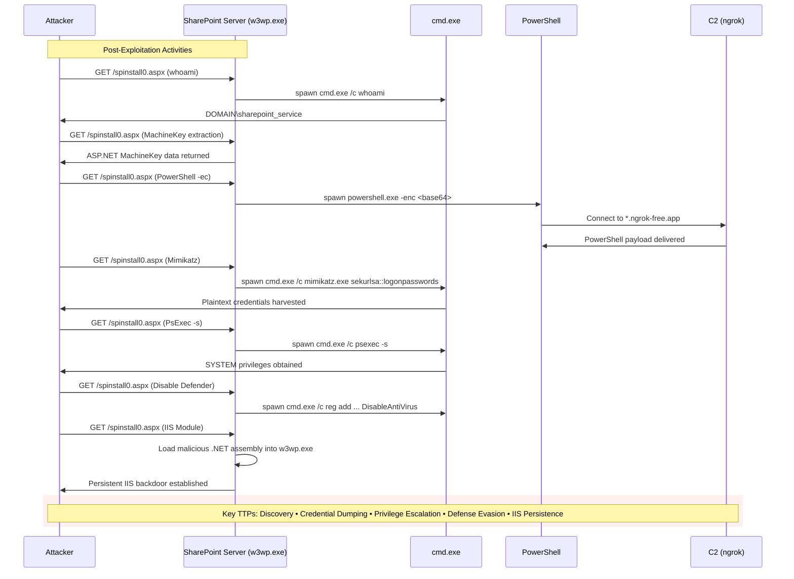

### Storm-2603 Exploits SharePoint Flaws to Deploy Warlock Ransomware
---

This guide is for splunk security analysts to detect/hunt for TTP's associated with the SharePoint "ToolShell" exploit concerning the threat actor name "Storm-2603".  The following TTP's were executed in a lab environment for testing the efficacy of these detections.

For the following queries to work the splunk common information model (CIM) add-on needs to be configured correctly, in particular the "Endpoint" data model.

https://help.splunk.com/en/splunk-cloud-platform/common-information-model/6.0/introduction/overview-of-the-splunk-common-information-model

https://help.splunk.com/en/splunk-cloud-platform/common-information-model/6.0/data-models/endpoint

---

`Storm-2603`, a suspected China-based threat actor, is actively exploiting recently disclosed vulnerabilities in on-premises Microsoft SharePoint servers (CVE-2025-49706 and CVE-2025-49704, and their variants CVE-2025-53770 and CVE-2025-53771) to gain initial access and deploy Warlock ransomware. The attacks involve deploying web shells, disabling security features, harvesting credentials, and leveraging lateral movement tools to ultimately distribute ransomware across compromised networks.


Beyond the initial exploitation and ransomware deployment, recent intelligence indicates that Storm-2603 and other threat actors are evolving their tactics to include in-memory web shell payloads to steal ASP.NET machine keys, making traditional file-based detection of web shells less effective. Additionally, the campaign has been observed leveraging known Ivanti EPMM vulnerabilities, expanding the initial access vectors beyond SharePoint.



### Threat Actor TTP's
---

### Initial Access & Web Shell Deployment (T1190, T1505.003):

Monitor for exploitation attempts against SharePoint servers targeting /layouts/15/ToolPane.aspx with a spoofed Referer header set to /_layouts/SignOut.aspx.

Detect the creation of suspicious .aspx files, particularly spinstall0.aspx or variants like ghostfile*.aspx, in SharePoint _layouts or TEMPLATE\LAYOUTS directories.

Look for PowerShell commands spawned from the SharePoint IIS process (w3wp.exe) attempting to write .aspx files.

### Defense Evasion (T1562.001):

Monitor for modifications to Windows Registry keys that disable Microsoft Defender protections, specifically those initiated by services.exe.

### Credential Access (T1003.001):

Detect the execution of Mimikatz, especially when targeting the Local Security Authority Subsystem Service (LSASS) memory for credential harvesting.

### Persistence (T1053.005, T1505.003):

Monitor for the creation or modification of scheduled tasks that execute suspicious payloads or scripts.

Detect modifications to Internet Information Services (IIS) components to launch suspicious .NET assemblies.

### Lateral Movement (T1021.002, T1570):

Monitor for the use of PsExec (e.g., PSEXESVC.EXE or other randomly named executables in C:\Windows\) and its associated named pipes for lateral movement.

Detect the use of the Impacket toolkit (e.g., smbexec.py, wmiexec.py, psexec.py, dcomexec.py, atexec.py) for remote code execution and lateral movement, often identifiable by specific command-line parameters.

### Privilege Escalation (T1068):

Detect the use of BadPotato for privilege escalation, which may involve in-memory execution and leveraging SeImpersonatePrivilege.

### Impact (T1486):

Monitor for Group Policy Object (GPO) modifications that distribute ransomware payloads.


<p align="center">
  
</p>

### Recently Observed Exploitation Technique
---
```sql
`comment("This detection rule identifies potential exploitation of the SharePoint ToolShell vulnerability (CVE-2025-53770, CVE-2025-53771) used by threat actors like CL-CRI-1040/Storm-2603.")`
`comment("TTP: The exploit involves sending a POST request to ToolPane.aspx in edit mode. A key indicator of malicious activity is a missing, null, or cross-domain Referer header, as legitimate requests should originate from the SharePoint server itself.")`
`web_data` http_method="POST" uri_path="/layouts/15/ToolPane.aspx" uri_query="*DisplayMode=Edit*"
`comment("Extract the hostname from the destination URL and the Referer header to compare them.")`
| rex field=url "https?:\/\/(?<dest_host>[^\/]+)"
| rex field=http_referrer "https?:\/\/(?<referrer_host>[^\/]+)"
`comment("Filter for requests where the Referer is null or from a different host than the destination. This is highly suspicious for this specific SharePoint page.")`
| where isnull(http_referrer) OR http_referrer="-" OR (isnotnull(referrer_host) AND dest_host!=referrer_host)
`comment("FP Note: False positives may occur with complex proxy setups or unusual but legitimate cross-domain web applications. To reduce noise, baseline normal traffic to this endpoint and consider creating a lookup of known-good referrers to exclude from this search.")`
| stats count min(_time) as firstTime max(_time) as lastTime values(url) as urls values(http_referrer) as referrers by src_ip, dest_ip, dest_host, http_user_agent
| `security_content_ctime(firstTime)`
| `security_content_ctime(lastTime)`
| `sharepoint_toolshell_exploitation_filter`
```

### SharePoint Web Shell Deployment
---
```sql
`comment("
-- name: Storm-2603 SharePoint Web Shell Deployment
-- author: Rob Weber
-- date: 2025-07-25
-- description: Detects the creation of suspicious ASPX files by the SharePoint IIS worker process (w3wp.exe). This activity is a key indicator of SharePoint exploitation, as seen in campaigns by threat actors like Storm-2603 to deploy web shells for initial access and persistence.
-- references:
--   - https://thehackernews.com/2025/07/storm-2603-exploits-sharepoint-flaws-to.html
--   - https://www.microsoft.com/en-us/security/blog/2025/07/22/disrupting-active-exploitation-of-on-premises-sharepoint-vulnerabilities/
-- mitre_tactic: Persistence, Initial Access
-- mitre_technique: T1505.003, T1190
")`

`comment("This search leverages file system data, looking for file creation events.")`
| tstats `security_content_summariesonly` count min(_time) as firstTime max(_time) as lastTime values(Filesystem.file_path) as file_path values(Filesystem.file_name) as file_name from datamodel=Endpoint.Filesystem
where Filesystem.process_name = "w3wp.exe" AND (Filesystem.file_name = "spinstall0.aspx" OR Filesystem.file_name = "*.aspx")
`comment("Focus on the SharePoint IIS worker process (w3wp.exe) creating ASPX files, including the specific IOC spinstall0.aspx.")`
by Filesystem.dest, Filesystem.user, Filesystem.process_name
| `drop_dm_object_name("Filesystem")`
| `security_content_ctime(firstTime)`
| `security_content_ctime(lastTime)`
| `comment("Post-filter for either the high-fidelity IOC filename or any ASPX file in sensitive SharePoint directories.")`
| where match(file_name, "(?i)spinstall0.aspx") OR match(file_path, "(?i)(\\\\_layouts\\\\|\\\\TEMPLATE\\\\LAYOUTS\\\\)")
| `comment("FP Tuning: Legitimate SharePoint updates or the deployment of custom solutions can occasionally write .aspx files to these directories. If legitimate activity is flagged, consider adding file names or more specific paths to an exclusion list.")`
```

### Disabling Microsoft Defender
---
```sql
`comment("
-- name: Disabling Microsoft Defender via Registry by services.exe
-- author: Rob Weber
-- date: 2025-07-25
-- description: Detects attempts to disable Microsoft Defender by modifying its registry keys. This technique is used by threat actors like Storm-2603 to evade defenses after gaining initial access. The rule specifically looks for modifications made by services.exe, which has been observed in recent Storm-2603 campaigns.
-- references:
--   - https://thehackernews.com/2025/07/storm-2603-exploits-sharepoint-flaws-to.html
-- mitre_tactic: Defense Evasion
-- mitre_technique: T1562.001
")`

`comment("This search looks for registry modification events from the Endpoint data model.")`
| tstats `security_content_summariesonly` count min(_time) as firstTime max(_time) as lastTime values(Registry.registry_path) as registry_path values(Registry.registry_value_name) as registry_value_name values(Registry.registry_value_data) as registry_value_data from datamodel=Endpoint.Registry
where Registry.process_name = "services.exe" AND Registry.registry_value_data = "0x00000001"
AND (Registry.registry_value_name IN ("DisableAntiSpyware", "DisableRealtimeMonitoring", "DisableBehaviorMonitoring", "DisableOnAccessProtection", "DisableScanOnRealtimeEnable"))
`comment("Focus on modifications by services.exe that set a registry value to 1 (disable) for specific Defender settings.")`
by Registry.dest, Registry.user, Registry.process_name
| `drop_dm_object_name("Registry")`
| `security_content_ctime(firstTime)`
| `security_content_ctime(lastTime)`
| `comment("Filter for registry paths related to Windows Defender policies.")`
| where match(registry_path, "(?i)SOFTWARE\\\\Policies\\\\Microsoft\\\\Windows Defender")
| `comment("FP Tuning: Legitimate system management tools or scripts may modify these registry keys. If this activity is expected, consider filtering by user or excluding specific administrative tools if their parent process information is available.")`
```

### Mimikatz Execution
---
```sql
`comment("
-- name: Mimikatz Execution for Credential Dumping
-- author: Rob Weber
-- date: 2025-07-25
-- description: Detects the execution of Mimikatz or similar tools attempting to dump credentials from memory, particularly from the LSASS process. This technique is used by threat actors like Storm-2603 to harvest credentials for lateral movement.
-- references:
--   - https://thehackernews.com/2025/07/storm-2603-exploits-sharepoint-flaws-to.html
-- mitre_tactic: Credential Access
-- mitre_technique: T1003.001
")`

`comment("This search looks for process execution events that contain command-line arguments typical of Mimikatz.")`
| tstats `security_content_summariesonly` count min(_time) as firstTime max(_time) as lastTime from datamodel=Endpoint.Processes where (Processes.process="*sekurlsa::logonpasswords*" OR Processes.process="*sekurlsa::minidump*" OR Processes.process="*lsadump::sam*" OR Processes.process="*lsadump::lsa*") by Processes.dest, Processes.user, Processes.parent_process_name, Processes.process_name, Processes.process
| `drop_dm_object_name("Processes")`
| `security_content_ctime(firstTime)`
| `security_content_ctime(lastTime)`
| `comment("FP Tuning: This detection may be triggered by legitimate security testing or administrative activity. If this is expected, consider filtering by specific users, hosts, or parent processes involved in authorized red team or security assessment activities.")`
```

### Scheduled Task Creation for Persistence
---
```sql
`comment("
-- name: Scheduled Task Creation for Persistence
-- author: Rob Weber
-- date: 2025-07-25
-- description: Detects the creation of a scheduled task using the schtasks.exe command-line utility. Threat actors, such as Storm-2603, frequently use scheduled tasks to establish persistence on compromised systems, ensuring their malicious code executes automatically at specified times or upon certain events.
-- references:
--   - https://thehackernews.com/2025/07/storm-2603-exploits-sharepoint-flaws-to.html
-- mitre_tactic: Persistence
-- mitre_technique: T1053.005
")`

`comment("This search looks for process execution events related to the creation of scheduled tasks.")`
| tstats `security_content_summariesonly` count min(_time) as firstTime max(_time) as lastTime from datamodel=Endpoint.Processes where Processes.process_name = "schtasks.exe" AND Processes.process = "*/create*" by Processes.dest, Processes.user, Processes.parent_process_name, Processes.process_name, Processes.process
| `drop_dm_object_name("Processes")`
| `security_content_ctime(firstTime)`
| `security_content_ctime(lastTime)`
| `comment("FP Tuning: Scheduled tasks are a common administrative tool. Legitimate software and administrators frequently create tasks. Review the parent process and the full command line (`process` field) to determine if the activity is benign. Consider creating an exclusion list for known legitimate parent processes or task commands.")`
```

### IIS Component Modification
---
```sql
`comment("
-- name: IIS Component Modification for Persistence
-- author: Rob Weber
-- date: 2025-07-25
-- description: Detects the use of the IIS command-line tool, appcmd.exe, to install or modify IIS modules. Threat actors, like Storm-2603, can abuse this functionality to install malicious .NET assemblies as IIS components, establishing a persistent backdoor on a web server.
-- references:
--   - https://thehackernews.com/2025/07/storm-2603-exploits-sharepoint-flaws-to.html
-- mitre_tactic: Persistence
-- mitre_technique: T1505.003
")`

`comment("This search looks for process execution events related to IIS configuration changes.")`
| tstats `security_content_summariesonly` count min(_time) as firstTime max(_time) as lastTime from datamodel=Endpoint.Processes where Processes.process_name = "appcmd.exe" AND (Processes.process LIKE "% add module %" OR Processes.process LIKE "% install module %" OR (Processes.process LIKE "% set config %" AND Processes.process LIKE "%section%modules%"))
`comment("Focus on appcmd.exe being used to add, install, or configure modules, which can be used for persistence.")`
by Processes.dest, Processes.user, Processes.parent_process_name, Processes.process_name, Processes.process
| `drop_dm_object_name("Processes")`
| `security_content_ctime(firstTime)`
| `security_content_ctime(lastTime)`
| `comment("FP Tuning: Legitimate IIS administration involves using appcmd.exe to manage modules. Review the parent process, user, and the full command line to determine if the activity is authorized. Exclude known administrative scripts, users, or specific benign module configurations if necessary.")`
```

### Common Hacking Tool Execution
---
```sql
`comment("This detection rule identifies the execution of common hacking and reconnaissance tools seen in the CL-CRI-1040/Storm-2603 toolkit.")`
| tstats `security_content_summariesonly` count min(_time) as firstTime max(_time) as lastTime from datamodel=Endpoint.Processes where Processes.process_name IN ("nxc.exe", "SharpHostInfo.exe", "masscan.exe", "sd.exe", "PsExec64.exe", "PsExec.exe") by Processes.dest, Processes.user, Processes.parent_process_name, Processes.process_name, Processes.process_path, Processes.process
`comment("Rename fields for better readability.")`
| rename "Processes.*" as *
`comment("FP Note: PsExec is a legitimate administrative tool. Its presence may be benign. Filter based on expected user activity, parent processes (e.g., not launched by an admin's interactive shell), or host groups to reduce noise. The other tools are highly indicative of malicious activity.")`
| `security_content_ctime(firstTime)`
| `security_content_ctime(lastTime)`
| `common_hacking_tool_execution_filter`
```

### PsExec Lateral Movement
---
```sql
`comment("
-- name: PsExec Lateral Movement
-- author: Rob Weber
-- date: 2025-07-25
-- description: Detects the execution of the PsExec service executable (PSEXESVC.exe) on a target host. This indicates that PsExec has been used from a remote system to execute commands, a technique commonly used for lateral movement by threat actors like Storm-2603.
-- references:
--   - https://thehackernews.com/2025/07/storm-2603-exploits-sharepoint-flaws-to.html
--   - https://redcanary.com/blog/threat-detection/threat-hunting-psexec-lateral-movement/
-- mitre_tactic: Lateral Movement
-- mitre_technique: T1021.002
")`

`comment("This search looks for process execution events on the target host, which are indicative of PsExec activity.")`
| tstats `security_content_summariesonly` count min(_time) as firstTime max(_time) as lastTime from datamodel=Endpoint.Processes
where Processes.parent_process_name = "services.exe" AND Processes.process_name = "PSEXESVC.exe"
`comment("The key logic identifies the default PsExec service executable (PSEXESVC.exe) being launched by the Service Control Manager (services.exe).")`
by Processes.dest, Processes.user, Processes.parent_process_name, Processes.process_name, Processes.process
| `drop_dm_object_name("Processes")`
| `security_content_ctime(firstTime)`
| `security_content_ctime(lastTime)`
| `comment("FP Tuning: Legitimate remote administration may use PsExec. If this is common in your environment, consider excluding alerts originating from known administrative subnets or involving specific admin accounts. Attackers can also rename the service executable, so a broader (but potentially noisier) companion rule could look for any non-standard process spawned by services.exe from the C:\\Windows directory.")`
```

### Impacket Toolkit Usage
---
```sql
`comment("
-- name: Impacket Lateral Movement Toolkit Usage
-- author: Rob Weber
-- date: 2025-07-25
-- description: Detects command execution patterns characteristic of the Impacket toolkit, specifically smbexec.py and wmiexec.py. These tools are frequently used for lateral movement by threat actors like Storm-2603. The detection focuses on the unique way these tools redirect command output to a file on an administrative share for retrieval.
-- references:
--   - https://thehackernews.com/2025/07/storm-2603-exploits-sharepoint-flaws-to.html
--   - https://www.microsoft.com/en-us/wdsi/threats/malware-encyclopedia-description?Name=HackTool:Win32/Impacket&threatId=-2147239074
-- mitre_tactic: Execution
-- mitre_technique: T1059.003, T1047
")`

`comment("This search looks for process execution events from the Endpoint data model.")`
| tstats `security_content_summariesonly` count min(_time) as firstTime max(_time) as lastTime from datamodel=Endpoint.Processes
where (Processes.parent_process_name IN ("WmiPrvSE.exe", "services.exe")) AND Processes.process_name = "cmd.exe" AND Processes.process LIKE "% 1> \\\\127.0.0.1\\%" AND Processes.process LIKE "% 2>&1"
`comment("The core logic identifies cmd.exe launched by WMI Provider Host or Services Control Manager with command output redirected to a local administrative share (C$ or ADMIN$), a distinct pattern for Impacket's wmiexec and smbexec.")`
by Processes.dest, Processes.user, Processes.parent_process_name, Processes.process_name, Processes.process
| `drop_dm_object_name("Processes")`
| `security_content_ctime(firstTime)`
| `security_content_ctime(lastTime)`
| `comment("FP Tuning: This pattern is highly specific to Impacket and has a low false positive rate. However, if legitimate custom administrative scripts produce similar command lines, they could be excluded by filtering on the specific command within the 'process' field or by the user account.")`
```

### BadPotato Privilege Escalation
---
```sql
`comment("
-- name: BadPotato Privilege Escalation
-- author: Rob Weber
-- date: 2025-07-25
-- description: Detects command-line activity referencing the 'pwncat' named pipe. This is the default pipe name created and used by the BadPotato privilege escalation tool, which has been leveraged by threat actors like Storm-2603 to elevate privileges to SYSTEM.
-- references:
--   - https://thehackernews.com/2025/07/storm-2603-exploits-sharepoint-flaws-to.html
--   - https://github.com/calebstewart/pwncat-badpotato
-- mitre_tactic: Privilege Escalation
-- mitre_technique: T1068
")`

`comment("This search looks for process execution events from the Endpoint data model.")`
| tstats `security_content_summariesonly` count min(_time) as firstTime max(_time) as lastTime from datamodel=Endpoint.Processes
where match(Processes.process, "(?i)\\\\pipe\\\\pwncat")
`comment("The core logic identifies command-line interaction with the default named pipe used by the BadPotato tool.")`
by Processes.dest, Processes.user, Processes.parent_process_name, Processes.process_name, Processes.process
| `drop_dm_object_name("Processes")`
| `security_content_ctime(firstTime)`
| `security_content_ctime(lastTime)`
| `comment("FP Tuning: This detection is highly specific to the default configuration of the pwncat variant of BadPotato. False positives are unlikely. However, the tool can be recompiled with a different named pipe, which would evade this detection.")`
```

### GPO Ransomware Distribution
---
```sql
`comment("
-- name: GPO Ransomware Distribution
-- author: Rob Weber
-- date: 2025-07-25
-- description: Detects the creation of new executable or script files within Group Policy Object (GPO) directories in SYSVOL. Threat actors like Storm-2603 abuse GPO to distribute ransomware and other malware across a domain by placing the payload in a GPO folder and creating a policy to execute it.
-- references:
--   - https://thehackernews.com/2025/07/storm-2603-exploits-sharepoint-flaws-to.html
-- mitre_tactic: Impact, Persistence
-- mitre_technique: T1486, T1484.001
")`

`comment("This search looks for file creation events in sensitive GPO directories on Domain Controllers.")`
| tstats `security_content_summariesonly` count min(_time) as firstTime max(_time) as lastTime values(Filesystem.file_path) as file_path from datamodel=Endpoint.Filesystem
where match(Filesystem.file_path, "(?i)\\\\SYSVOL\\\\.*\\\\Policies\\\\") AND (Filesystem.file_name="*.exe" OR Filesystem.file_name="*.ps1" OR Filesystem.file_name="*.bat" OR Filesystem.file_name="*.vbs" OR Filesystem.file_name="*.dll")
`comment("The core logic identifies new executable, script, or library files being written to SYSVOL GPO paths.")`
by Filesystem.dest, Filesystem.user, Filesystem.process_name, Filesystem.file_name
| `drop_dm_object_name("Filesystem")`
| `security_content_ctime(firstTime)`
| `security_content_ctime(lastTime)`
| `comment("FP Tuning: Legitimate software deployment or script push via GPO will trigger this. This is an alert that requires investigation of the file and the associated GPO change. To tune, you could create an allow-list of known software/script names (`file_name`) that are deployed via GPO in your environment.")`
```

### AK47/X2ANYLOCK Ransomware Activity
---
```sql
`comment("This detection rule identifies the creation of files with the .x2anylock extension, a specific indicator of compromise for the AK47/X2ANYLOCK ransomware, which is part of the Project AK47 toolset.")`
| tstats `security_content_summariesonly` count min(_time) as firstTime max(_time) as lastTime from datamodel=Endpoint.Filesystem where Filesystem.file_name = "*.x2anylock" by Filesystem.dest, Filesystem.user, Filesystem.process_name, Filesystem.file_name
`comment("Rename fields for better readability and consistency.")`
| rename "Filesystem.*" as *
`comment("Format timestamps for human-readable output.")`
| `security_content_ctime(firstTime)`
| `security_content_ctime(lastTime)`
`comment("FP Note: False positives are highly unlikely given the specific file extension. Alerts may be generated in sandboxed environments where this malware is being analyzed.")`
| `ak47_x2anylock_ransomware_activity_filter`
```

### AK47C2 Communication
---
```sql
// Data source: This query is designed for the Splunk Common Information Model (CIM).
// It targets the Network_Resolution (for DNS) and Web (for HTTP) data models.
// Ensure your DNS and web proxy/firewall logs are mapped to these models.
(
    // Detect DNS queries for the C2 domain, used by the AK47DNS backdoor.
    `tstats` summariesonly=true count from datamodel=Network_Resolution where All_Dns.query IN ("*update.updatemicfosoft.com", "*microsfot.org") by _time, All_Dns.query, All_Dns.src, All_Dns.user, All_Dns.process_name
    | `drop_dm_object_name("All_Dns")`
    | rename query as c2_indicator, src as source_address, user as user_name, process_name as process
    | eval activity_type="AK47DNS C2 Communication"
    // The AK47DNS backdoor uses complex, structured subdomains for data exfiltration.
    // Example: <sessionID>.<computerName>.update.micfosoft.com
    // FP Tuning: To increase fidelity, you could filter for queries with a high number of subdomains.
    // For example: | eval subdomain_count = mvcount(split(c2_indicator, ".")) | where subdomain_count > 5
)
| append [
    // Detect HTTP POST requests to the C2 domain, used by the AK47HTTP backdoor.
    `tstats` summariesonly=true count from datamodel=Web where (Web.dest="update.updatemicfosoft.com" OR Web.dest="microsfot.org") AND Web.http_method="POST" AND (Web.uri_path="/" OR Web.uri_path="") by _time, Web.url, Web.src, Web.user, Web.process_name
    | `drop_dm_object_name("Web")`
    | rename url as c2_indicator, src as source_address, user as user_name, process_name as process
    | eval activity_type="AK47HTTP C2 Communication"
]
// Final formatting of the results.
| table _time, activity_type, source_address, user_name, process, c2_indicator
```

### Antivirus Terminator Usage
---
```sql
// Data source: This query requires Windows Event Logs, specifically the System log with Event ID 7045 (A service was installed).
// It assumes the data is ingested into a Splunk index (e.g., wineventlog, os, etc.).
(index=* sourcetype="WinEventLog:System" EventCode=7045)
// Extract the service name and image path from the event message for reliable matching.
| rex field=Message "Service Name:\s+(?<service_name>\S+)"
| rex field=Message "Service File Name:\s+(?<image_path>.+?)\s+Service Type:"
// Look for the specific service name and driver file associated with the Antivirus Terminator tool.
| where service_name = "ServiceMouse" AND image_path LIKE "%ServiceMouse.sys"

// FP Tuning: The combination of service name and driver file is highly specific.
// The threat report identifies "VMToolsEng.exe" as the process that installs the service.
// Correlating this alert with process creation logs for "VMToolsEng.exe" could increase confidence.

| stats count min(_time) as firstTime max(_time) as lastTime by host, Account_Name, service_name, image_path
| rename host as dest, Account_Name as user
| convert ctime(firstTime) ctime(lastTime)
| project firstTime, lastTime, dest, user, service_name, image_path, count
```

### DLL Hijacking Ransomware
---
```sql
// Data source: This query is designed for Sysmon Event ID 7 (Image Loaded).
// Ensure your Sysmon data is ingested into Splunk, typically with a sourcetype like 'XmlWinEventLog:Microsoft-Windows-Sysmon/Operational'.
// The `sysmon` macro should be defined in your environment to point to the correct index and sourcetype.
`sysmon` EventCode=7
// Parse the full path of the parent process and the loaded DLL to extract the folder path and file name for each.
| rex field=Image "(?<process_path>.*\\\\)(?<process_name>[^\\\\]+)$"
| rex field=ImageLoaded "(?<dll_path>.*\\\\)(?<dll_name>[^\\\\]+)$"

// Filter for the specific process and DLL combinations known to be abused by Storm-2603.
| where (process_name="7z.exe" AND dll_name="7z.dll")
    OR (process_name="MpCmdRun.exe" AND dll_name="Mpclient.dll")
    OR (process_name="clink_x86.exe" AND dll_name="clink_dll_x86.dll")

// A key indicator of side-loading is when the malicious DLL is loaded from the same directory as the hijacked executable.
| where process_path = dll_path

// Focus on execution from non-standard, suspicious folders often used for staging malware.
| where match(process_path, "(?i)C:\\Users\\Public\\")
    OR match(process_path, "(?i)C:\\ProgramData\\")
    OR match(process_path, "(?i)C:\\Windows\\Temp\\")
    OR match(process_path, "(?i)C:\\Temp\\")
    OR match(process_path, "(?i)C:\\PerfLogs\\")

// FP Tuning: Exclude legitimate Microsoft Defender updates, which are known to run MpCmdRun.exe from C:\ProgramData.
| where NOT (process_name="MpCmdRun.exe" AND process_path LIKE "C:\\ProgramData\\Microsoft\\Windows Defender\\Platform\\%")

// Aggregate results and format for analyst review.
| stats count min(_time) as firstTime max(_time) as lastTime by host, User, process_name, process_path, Image, ImageLoaded, Hashes
| rename host as dest, User as user, Image as process_full_path, ImageLoaded as dll_full_path, Hashes as file_hashes
| convert ctime(firstTime) ctime(lastTime)
| project firstTime, lastTime, dest, user, process_name, process_path, process_full_path, dll_full_path, file_hashes, count
```
```sql
`comment("This detection rule identifies potential DLL side-loading activity associated with the CL-CRI-1040 threat actor, who uses legitimate executables to load malicious DLLs.")`
| tstats `security_content_summariesonly` count min(_time) as firstTime max(_time) as lastTime from datamodel=Endpoint.ImageLoads where (ImageLoads.process_name IN ("7z.exe", "clink_x86.exe")) AND (ImageLoads.file_name IN ("7z.dll", "clink_dll_x86.dll")) by ImageLoads.dest, ImageLoads.user, ImageLoads.process_name, ImageLoads.process_path, ImageLoads.file_name, ImageLoads.file_path
`comment("Rename fields for better readability.")`
| rename "ImageLoads.*" as *
`comment("Filter for the specific executable/DLL pairs used by the actor.")`
| where (process_name="7z.exe" AND file_name="7z.dll") OR (process_name="clink_x86.exe" AND file_name="clink_dll_x86.dll")
`comment("Ensure the DLL is loaded from the same directory as the executable, a key indicator of side-loading.")`
| rex field=process_path "(?<process_dir>.*)[\/\\\\].*"
| rex field=file_path "(?<file_dir>.*)[\/\\\\].*"
| where process_dir = file_dir
`comment("FP Note: While these specific pairs are linked to CL-CRI-1040, other legitimate software might use a similar structure. Consider excluding known-good application paths if false positives occur.")`
| `security_content_ctime(firstTime)`
| `security_content_ctime(lastTime)`
| `dll_side_loading_for_payload_deployment_filter`
```