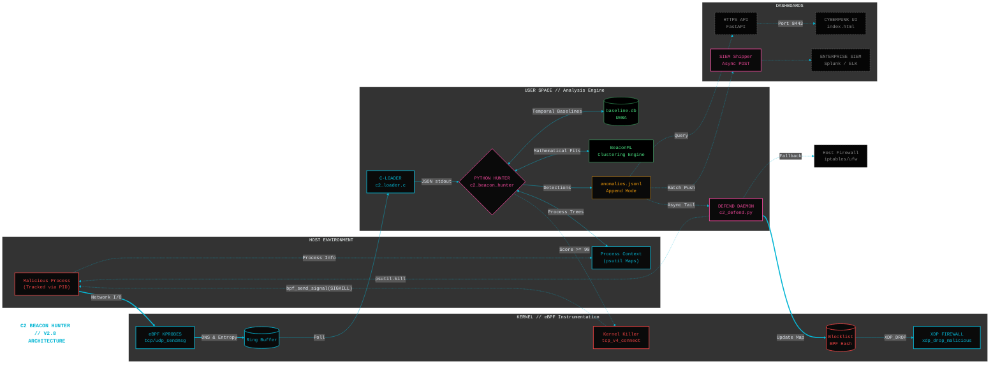

# Program Increment (PI) Review: v2.8 Active Defense, Enterprise Sensor, & DFIR

**Role:** Lead Developer / Architect

**Scope:** `v2.8/` Directory Iterations (2.8.1 - 2.8.4)

**Objective:** Transition the C2 detection engine from a standalone local script into an enterprise-ready, wire-speed security sensor with active containment, SOC visualization capabilities, and streamlined forensic triage.

Per architectural guardrails, all previous core functionality—including the complete MITRE ATT&CK mapping logic—was strictly preserved during these capability upgrades.

---

## Epic 1: Closed-Loop Active Response (`c2_defend`)

**Status:** DONE

**Objective:** Transition the detection engine from a passive IDS into an active IPS to stop unprofiled beacons before they can execute secondary exploitation commands.

### Features Delivered:
* **Story 1.1: Asynchronous Daemon Tailer**
  * *Component:* `c2_defend.py`
  * *Implementation:* Engineered a lightweight daemon that continuously tails `../output/anomalies.jsonl`. It isolates execution context from the high-speed eBPF packet loops, engaging mitigation protocols only when evaluating JSON events where `score >= 90`.
* **Story 1.2: Surgical Process Termination**
  * *Component:* `c2_defend.py` -> `terminate_process()`
  * *Implementation:* Utilizes `psutil` to map the malicious PID. Sends an immediate `SIGKILL` at the kernel level to terminate the beaconing process and halt the reverse shell loop.
* **Story 1.3: Dynamic Network Isolation**
  * *Component:* `c2_defend.py` -> `isolate_network()`
  * *Implementation:* Achieves full system abstraction by detecting the active host firewall (`firewalld`, `ufw`, or `iptables`). It dynamically injects surgical drop rules (e.g., `firewall-cmd --add-rich-rule`) to blackhole the extracted C2 destination IP and port, preventing malware from reconnecting even if the process restarts.
* **Story 1.4: Safe Rollback Utility**
  * *Component:* `undo.py`
  * *Implementation:* Mitigates the operational risk of automated false positives. The daemon logs all firewall actions to `blocklist.txt`. `undo.py` parses this file to surgically reverse specific iptables/rich-rules and restore network access instantly.

---

## Epic 2: Enterprise Export & Visualization (Business Epic)

**Status:** DONE

**Objective:** Establish the "pane of glass" for Security Operations Centers (SOC) and enable asynchronous telemetry forwarding.

### Features Delivered:
* **Story 2.1: Asynchronous SIEM Forwarding**
    * *Component:* `c2_beacon_hunter.py`
    * *Implementation:* Built a thread-safe `SIEMShipper` class utilizing a daemon worker and Queue system. This allows the high-speed packet evaluation loop to ship JSON anomalies to ELK/Splunk via HTTP POST without experiencing blocking delays or network timeouts.
* **Story 2.2: REST API Telemetry Backend**
    * *Component:* `api_server.py`, `generate_certs.sh`
    * *Implementation:* Developed a lightweight FastAPI web server running on Python 3.12-slim. Exposes `/api/v1/metrics`, `/api/v1/anomalies`, and `/api/v1/threat_intel` endpoints.
    * *Security:* Secured the Uvicorn server with 4096-bit RSA self-signed certificates (running on port `8443`) for encrypted local access.
* **Story 2.3: SOC Triage Dashboard**
    * *Component:* `static/index.html`
    * *Implementation:* Created a single-page, cyberpunk-themed web application utilizing Tailwind CSS. It auto-refreshes every 5 seconds, displaying real-time eBPF connection metrics, isolated process trees, ML anomaly scoring, and raw Threat Intelligence (CTI) terminal outputs.

---

## Epic 3: Architectural Enablers (In-Kernel Upgrades)

**Status:** DONE

**Objective:** Deprecate slow user-space Python dependencies (Scapy) to extend the architectural runway for wire-speed network blocking (XDP).

### Features Delivered:
* **Story 3.1: In-Kernel DNS Parsing**
    * *Component:* `dev/probes/c2_probe.bpf.c`
    * *Implementation:* Wrote a direct parser targeting `udp_sendmsg` on port 53. Extracts the DNS domain string directly from the packet payload memory buffer before it ever leaves the kernel.
* **Story 3.2: Native Payload Entropy Calculation (eBPF)**
    * *Component:* `dev/probes/c2_probe.bpf.c`
    * *Implementation:* Shifted Shannon entropy calculations for outbound web traffic (ports 80, 443, 8080, 8443) entirely into the kernel. Bypassed eBPF's strict floating-point ban by engineering an integer-scaled Look-Up Table (LUT) to calculate byte frequencies and entropy scores in microseconds on the `tcp_sendmsg` buffer.
* **Story 3.3: High-Speed User-Space Ingestion Pipeline**
    * *Component:* `dev/probes/c2_loader.c`
    * *Implementation:* Upgraded the native C-Loader to poll the eBPF ring buffer, format the kernel-extracted DNS strings and unscaled floating-point entropy scores into JSON, and flush them to `stdout` for the Python pipeline to cluster.

---

## Epic 4: The "Holy Grail" (eBPF Enforcement)

**Status:** DONE

**Objective:** Implement wire-speed, sub-millisecond threat mitigation, deprecating user-space firewalls.

### Features Delivered:
* **Story 4.1: Kernel Process Termination**
    * *Component:* `dev/probes/c2_probe.bpf.c`
    * *Implementation:* Hooked `tcp_v4_connect`. If the destination IP matches the BPF map blocklist, the kernel executes `bpf_send_signal(SIGKILL)` directly, killing the malware before the SYN packet is even constructed.
* **Story 4.2: XDP Wire-Speed Blackholing**
    * *Component:* `dev/probes/c2_probe.bpf.c`
    * *Implementation:* Developed an eXpress Data Path (XDP) program attached directly to the NIC driver. Packets matching the BPF map are hit with `XDP_DROP` before the Linux network stack allocates `sk_buff` memory, rendering the system impervious to high-volume C2 reconnect attempts.

---

## Enabler: Live DFIR Triage & Enrichment

**Status:** DONE

**Objective:** Provide SOC analysts with actionable, volatile forensic data before the automated defense scripts terminate the offending process.

### Features Delivered:
* **Host Volatile Extraction:**
  * *Component:* `DFIR/live_triage.sh`
  * *Implementation:* Captures volatile artifacts directly from `/proc/$PID/` immediately upon a high-score detection. Extracts the true command line, generates a SHA256 hash of the binary, and dumps open file descriptors and environment variables before `c2_defend.py` issues the `SIGKILL`.
* **Automated Threat Intel (CTI) Enrichment:**
  * *Component:* `DFIR/threat_intel_check.sh`
  * *Implementation:* Extracts high-confidence remote IPs from the JSON logs and asynchronously queries AlienVault OTX, GreyNoise, VirusTotal, and Shodan. Identifies modern C2 frameworks (Sliver, Havoc, Nighthawk) via JARM TLS fingerprints and outputs a consolidated SOC report.
* **Triage Orchestration Wrapper:**
  * *Component:* `c2_defend/run.sh`
  * *Implementation:* Provides an interactive shell interface to orchestrate the pipeline: executing Live Triage, running CTI enrichment, and finally triggering containment.

---

## Integration Sign-Off
The `c2_defend` active response subsystem and DFIR tools have been successfully integrated and verified against the `v2.8` eBPF architecture. The append-only file locks utilized by the core JSON pipeline prevent I/O contention, ensuring the active defense daemon responds to C2 beacons in near real-time, while the new enterprise REST API provides continuous visibility to the SOC without impacting kernel tracing performance.