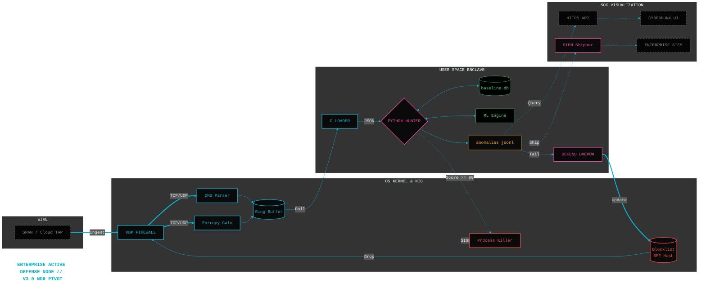

# Feature Planning: v3.0 Enterprise NDR Pivot

**Theme:** Scalable Cloud & Enterprise Network Detection

**Target Architecture:** Network Detection and Response (NDR)

**Business Driver:** Expanding visibility from single-host endpoints to enterprise core infrastructure (AWS Transit Gateway, Azure vWAN, SPAN Ports).

## Architectural Pivot Overview
The current architecture excels as an Endpoint Detection and Response (EDR) sensor, heavily reliant on mapping network traffic to specific Process IDs (`PID`, `process_tree`).

To scale to multi-gigabit enterprise networks via Core Router SPAN ports or Cloud Traffic Mirroring, we lose host context. Version 3.0 represents a total architectural pivot: the analytical entity shifts from "Processes" to "Internal Subnet IPs."

---

## Epic 1: The Promiscuous eBPF Parser
**Objective:** Shift from hooking host sockets (`kprobes`) to parsing raw Ethernet frames off the wire.
* **Story 1.1:** Develop a Traffic Control (TC) or XDP eBPF program capable of running in promiscuous mode on dedicated sniffing interfaces (e.g., `eth1`).
* **Story 1.2:** Implement robust header parsing to extract Ethernet, IP, TCP, and UDP tuple data from raw wire streams.

## Epic 2: In-Kernel Flow State Tracking (The Heavy Lifter)
**Objective:** Prevent CPU meltdown by tracking connection states entirely inside kernel memory rather than passing millions of packets to Python.
* **Story 2.1:** Construct highly concurrent BPF Hash Maps keyed by the `(Source IP, Dest IP, Dest Port)` tuple.
* **Story 2.2:** Program the kernel to independently calculate delta intervals, compute payload entropy, and maintain moving averages (`outbound_ratio`, `cv`) directly inside the BPF Maps.
* **Story 2.3:** Update the Python detection engine to wake up periodically and sweep the BPF Maps for aggregated statistics, drastically reducing user-space context switches.

## Epic 3: ML Engine Evolution (Subnet Clustering)
**Objective:** Adapt the UEBA and clustering algorithms to evaluate network-level behavior rather than process-level behavior.
* **Story 3.1:** Refactor the baseline learner to establish temporal baselines utilizing CIDR blocks (e.g., modeling normal variance for the `10.0.5.0/24` subnet).
* **Story 3.2:** Upgrade the ML clustering module to ingest the new tuple structures, optimizing K-Means and DBSCAN to detect mathematically perfect beaconing from internal enterprise IPs to unknown external infrastructure.

## Epic 4: Cloud-Native Flow Log Ingestion
**Objective:** Support serverless and PaaS cloud environments where deploying a virtual TAP or SPAN interface is impossible.
* **Story 4.1:** Build ingestion adapters for AWS VPC Flow Logs, Azure NSG Flow Logs, and GCP VPC Telemetry.
* **Story 4.2:** Optimize the detection engine to operate solely on header-derived timing intervals, compensating for the loss of payload entropy data inherent to standard cloud flow logs.