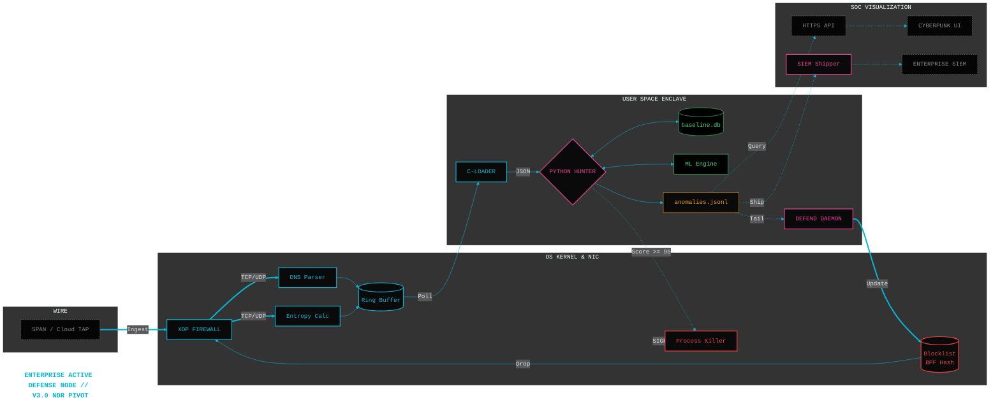

# Feature Planning: v3.0 Enterprise NDR Pivot

**Theme:** Scalable Cloud & Enterprise Network Detection

**Target Architecture:** Network Detection and Response (NDR)

**Business Driver:** Expanding visibility from single-host endpoints to enterprise core infrastructure (AWS Transit Gateway, Azure vWAN, SPAN Ports).

## Architectural Pivot Overview
The current architecture excels as an Endpoint Detection and Response (EDR) sensor, heavily reliant on mapping network traffic to specific Process IDs (`PID`, `process_tree`).

To scale to multi-gigabit enterprise networks via Core Router SPAN ports or Cloud Traffic Mirroring, we lose host context. Version 3.0 represents a total architectural pivot: the analytical entity shifts from "Processes" to "Internal Subnet IPs / Flow Tuples" for wire-speed, centralised detection.



---

## Epic 1: Promiscuous eBPF Parser (Wire-Speed Ingestion)

**Status:** Planned

**Objective:** Shift from host kprobes to raw wire parsing.

- Story 1.1: TC/XDP program in promiscuous mode on sniffing interfaces
- Story 1.2: Robust Ethernet/IP/TCP/UDP header parsing
- Story 1.3: In-kernel flow state tracking (5-tuple maps)

---

## Epic 2: In-Kernel Flow State Tracking

**Status:** Planned

**Objective:** Keep heavy lifting in the kernel to prevent user-space overload.

- Story 2.1: BPF Hash Maps for interval, entropy, CV, and packet-size tracking
- Story 2.2: Kernel-side aggregation before ringbuf submission

---

## Epic 3: ML Engine Evolution (Subnet Clustering)

**Status:** Planned

**Objective:** Adapt UEBA and clustering to network-level (not process-level) behaviour.

- Story 3.1: CIDR-based baselines (10.0.5.0/24, etc.)
- Story 3.2: 3D+ clustering with flow metadata

---

## Epic 4: Cloud-Native Flow Log Ingestion

**Status:** Planned

**Objective:** Support environments where host eBPF is impossible.

- Story 4.1: Adapters for AWS VPC Flow Logs, Azure NSG, GCP
- Story 4.2: Pure flow-log mode with reduced entropy features

---

## **Epic 5: Centralized Postgres Backend (Database Migration)**

**Status:** Planned (v3.0 Core)

**Objective:** Replace per-host SQLite with a central, scalable Postgres database for enterprise/multi-host deployments.

### Why Postgres in v3.0?
- Single endpoint → SQLite remains optimal (fast, zero-config)
- Enterprise / multi-host / cloud NDR → Postgres is required for:
  - Concurrent writes from multiple sensors
  - Advanced indexing and partitioning
  - Centralized UEBA across the entire fleet
  - High-availability and replication
  - Easier integration with BI/SIEM tools

### Features to Deliver:
- Story 5.1: Dual-backend support (SQLite for single-host, Postgres for enterprise) via config flag
- Story 5.2: SQLAlchemy + asyncpg for high-performance writes
- Story 5.3: Migration script (`sqlite_to_postgres.py`) for seamless upgrade
- Story 5.4: Partitioning by day + process_name for fast queries
- Story 5.5: Connection pooling and read replicas for SOC dashboard scale
- Story 5.6: Baseline learner updated to use Postgres for cross-host UEBA

**Migration Strategy:**
- v2.8.2+ continues using SQLite (no breaking change)
- v3.0 introduces optional Postgres backend
- Single-host users stay on SQLite if desired

---

## Epic 6: Enterprise SOC & Orchestration Layer

**Status:** Planned

**Objective:** Central dashboard and policy engine.

- Story 6.1: Multi-sensor aggregation API
- Story 6.2: Global blocklist propagation via Postgres
- Story 6.3: Alert correlation across hosts

---

**Target Release:** v3.0 (Q2 2026)

**Last updated:** March 2026
```