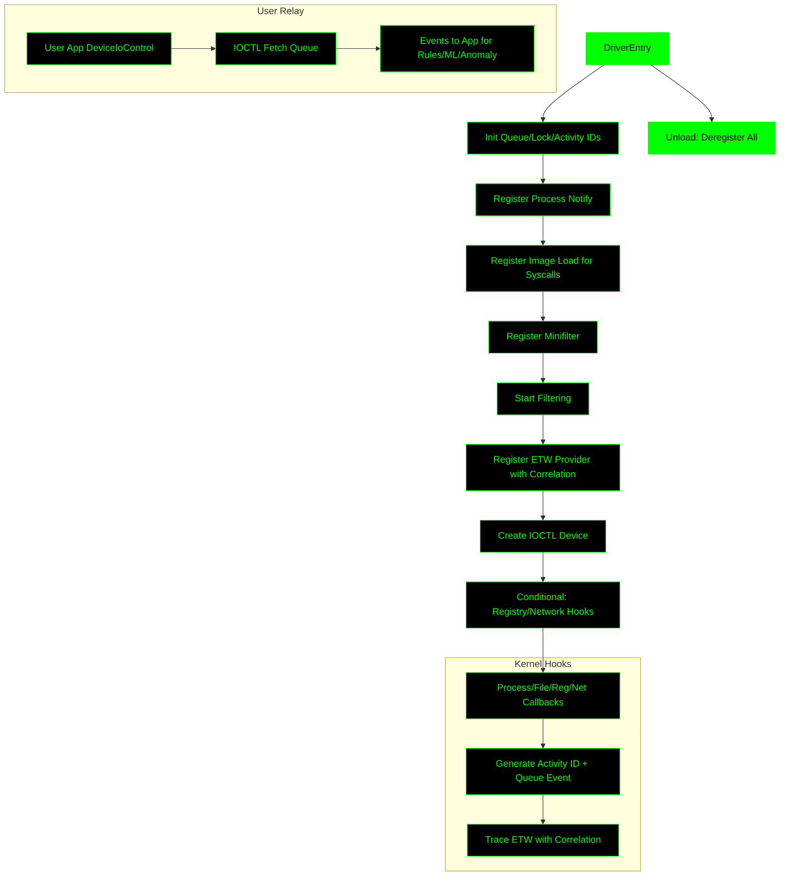

# Endpoint Monitor Driver (Rust Kernel Project)

## Overview
Rust-based Windows kernel driver providing deep, efficient visibility for EDR/XDR apps. Collects/relays events from processes, files, registry, network, syscalls; supports ETW correlation. Tuned for performance: fixed ring buffer, minimal locks/allocs, feature-gating for selectivity. Foundation for user-mode app handling rules/ML.

## Directory Layout
```
endpoint_project/
├── README.md
├── prepare_test_env.ps1        # VM setup
├── driver.inf                  # Minifilter INF
├── rust-driver/                # Kernel crate
│   ├── Cargo.toml
│   ├── build.rs
│   ├── Makefile.toml           # Optional
│   ├── src/lib.rs
│   └── test_kernel_driver.ps1  # Build/load/unload
└── user-mode/                  # User-mode pilot app
    ├── Cargo.toml
    ├── src/main.rs             # IOCTL client
    └── test_user_mode.ps1      # Build/run
```


## Features
- Hooks: Process (PsSetCreateProcessNotifyRoutineEx), file (minifilter IRP_MJ_CREATE/READ/WRITE), image/syscall (PsSetLoadImageNotifyRoutine), registry (CmRegisterCallbackEx, gated), network (WFP callouts, gated), threads (PsSetCreateThreadNotifyRoutine, gated), objects (ObRegisterCallbacks, gated), memory (Mm callbacks, gated), power/device (PoRegisterPowerSettingCallback, gated).
- ETW: Provider with activity ID correlation.
- Relay: IOCTL for real-time events (0x80002004).
- Prep: Enriched events (activity IDs, hashes) for app rules/ML.
- Perf: <1% CPU target; no hot-path allocs, O(1) queue.
- Extensible: Cargo features; tamper stub.

## Setup
1. **Build Kernel**: In EWDK prompt, cd rust-driver; `cargo build --release --features="registry,network"`. Rename .dll to .sys.
2. **Sign/Load**: `bcdedit /set testsigning on`; use test_kernel_driver.ps1 (handles sign/load/unload).
3. **Pilot App (User-Mode)**: cd user-mode; use test_user_mode.ps1 (build/run IOCTL poller with basic anomaly logging).
4. **VM Prep**: Run prepare_test_env.ps1 (creates VM, installs prereqs, copies files).
5. **Debug**: WinDbg + DbgPrint; ETW via logman; profile with xperf.

## Risks to Windows Kernel
Kernel drivers pose high risks due to ring-0 execution: BSODs from crashes, memory corruption, privilege escalation, or PatchGuard triggers on unauthorized modifications.

#### Key Risks in This Project
- **Crashes/BSODs**: Unsafe Rust code or bad pointers could fault.
- **Performance Overhead**: Heavy hooking/allocations might slow system.
- **Security Holes**: Injection detection logic could be bypassed or cause false positives/negatives.
- **Compatibility**: Windows updates/PatchGuard could break callbacks.
- **Resource Leaks**: Unreleased contexts/queues.

### Mitigations Implemented
- **Rust Safety**: Ownership/borrow checker minimizes null derefs/memory bugs; no_std + wdk-alloc for kernel-safe allocs.
- **Stable APIs Only**: Callbacks (PsSet*, FltRegisterFilter, ObRegisterCallbacks) avoid undocumented/SSDT hooking – PatchGuard-safe.
- **Feature Gating**: Optional hooks (e.g., threads/objects) reduce active code; compile-time disable for minimal footprint.
- **Performance Tuning**: Atomic ring buffer (O(1), no reallocs); fixed-point scores (no FP ops); stream caching avoids repeated queries.
- **Error Handling**: NT_SUCCESS checks everywhere; context cleanup callbacks prevent leaks.
- **Testing/Isolation**: VM-only testing; Driver Verifier/xperf for profiling; no production flags (e.g., /INTEGRITYCHECK enforced).
- **Lightweight Design**: Short locks, conditional tracing; drop overflow events to prevent bogging.

### NOTE: This project is in early development.

- **Feb 2026**, as enhances are made so to will be made in this project:

### Current Support
Microsoft's `windows-drivers-rs` framework enables experimental Rust drivers for WDM/KMDF/UMDF on Windows 11/Server 2022/2025. Early stage: Loadable with test signing, manual WHCP approval needed for production. Used in Surface/Hyper-V components for safety (reduces 70% memory bugs vs. C/C++). ARM64 and auto-deps in progress; not recommended for prod yet.

### Future Enhancements
Mid-2026+: Streamlined WHCP certification, full API bindings, AI-assisted C/C++ to Rust translation. Goal: Eliminate legacy vulnerabilities; broader kernel adoption (e.g., Windows 11 26H1+). No full OS rewrite planned; focus on secure drivers/partners.

## Kernel Driver Initialization Flowchart
